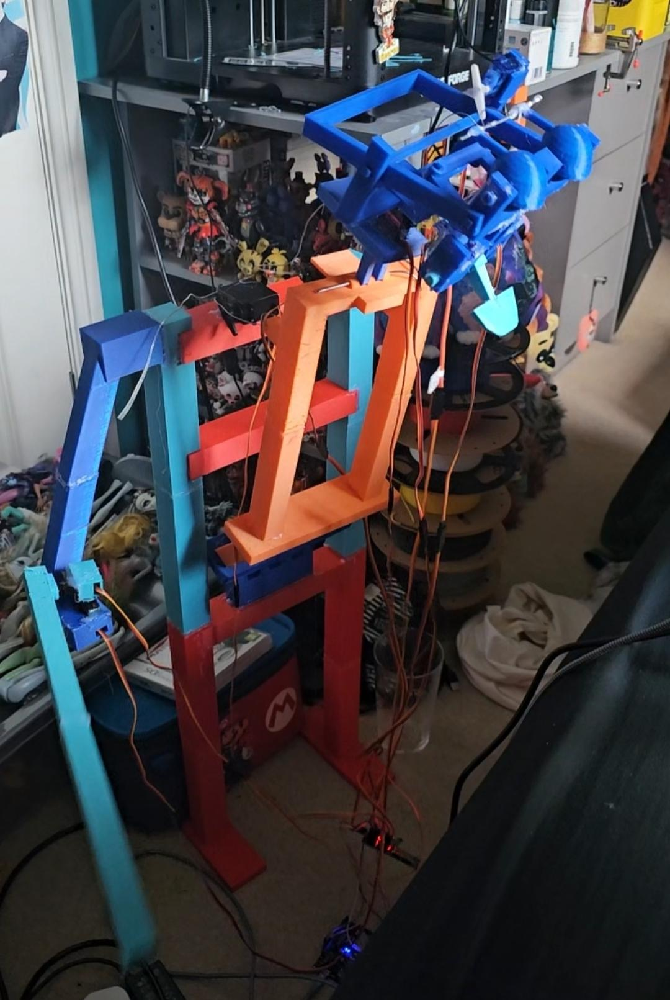

# Fatz Gorilla — 3D Model

## Overview

A detailed 3D model of the Fatz Gorilla robot created in **Blender**, inspired by the classic animatronic characters of **The Rock-afire Explosion**.

The project focused on 3D modelling, mechanical forms, proportions, detailing and visualisation. A physical test print was also produced to evaluate the model in the real world.

## Software

* Blender

## Skills Demonstrated

* 3D Modelling
* Hard-Surface Modelling
* Mechanical Visualisation
* 3D Design
* Rendering
* 3D Printing

## Renders

### Hero Render

### Front View

### Side View

### Top View

### Back View 

## 🎥 Video Showcase

A short showcase video demonstrating the completed 3D model.

Youtube Link: https://www.youtube.com/shorts/Zw0AB3Q9fxs 

## Physical Prototype

A test print of the model was produced to evaluate the physical appearance, proportions and printability of the design.

## Commercial Availability

The completed 3D model is available for purchase through my **Cults3D** store.

**Cults3D:** https://cults3d.com/en/users/ellaw/3d-models

The original 3D model/source files are intentionally not included in this repository.

## Inspiration & Disclaimer

This project was inspired by **The Rock-afire Explosion** and its classic animatronic characters.

This is an independent fan-made 3D modelling project and is not affiliated with, endorsed by, or officially associated with the original creators or rights holders.

---

**More robotics, animatronics and 3D modelling projects coming soon.**
